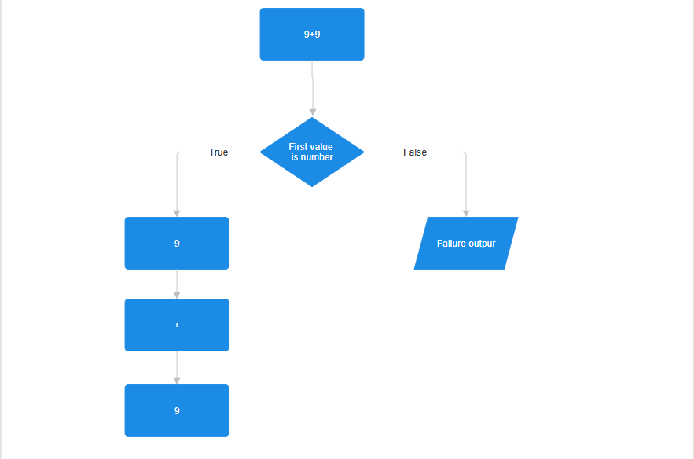
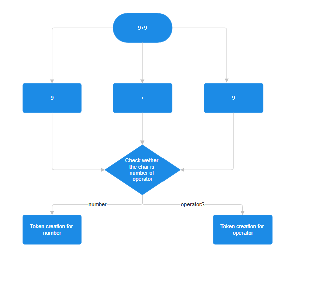

# White paper

This is implementation of python3 interpreter but in C

Interpreter is software that executes source code without first compiling it to machine code.(https://en.wikipedia.org/wiki/Interpreter_(computing))

# Grammar
Text->Number->Operator->Number->Operator...so on.
>this grammar tells that first should be a number followed by a operator and so on.

**Parse**-This should check for the grammar, the syntax should be 0 1 2 3.. so on. Where even must be number and odd operator. 



# Design Patterns

**fgets**- I choose this for taking input as there are multiple ways this seems the most bare bone to me. It was quite easy to implement and also stores to the character array automatically.

**Token**- Token is the smallest unit of program. 
In my case token can have two things:-
  1. Type- Wether the value is operator or number
  2. Value- the value itself
```bash
typedef struct {
  int type;
  char operator_value;
  int number_value
}Token;
```
*type*- Type in token will be value 0 or 1. 
  1. 0 represent an Integer
  2. 1 represent an Character
  
**Logic**- I am making two arrays 
```bash
  int nums[MAX_CAPACITY]={6,7};//dummy values
  char operators[MAX_CAPACITY]={'+'};//dummy values
```
After that values are read in this order
```bash
  6+7
```



